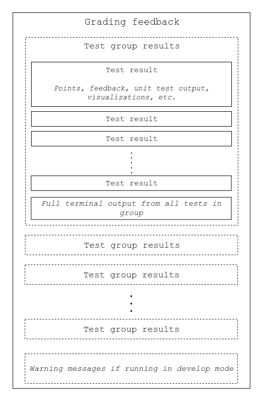

# Graderutils

Python library that handles grader test suite management, file validation and test feedback formatting.
Originally developed to enable HTML feedback for programming exercise grading output for courses served on the [A+](https://github.com/apluslms/a-plus) platform.
The A+ platform is not required to run graderutils.

## Features

* Running `unittest.TestCase` tests and producing generic JSON results that may be converted into HTML.
* [Validation tasks](graderutils#validation-tasks) before running tests.
* Restricting allowed Python syntax using black- and whitelists of [AST](https://docs.python.org/3/library/ast.html) node names.
* Formatting tracebacks and exception messages to include only essential information (the full, unformatted traceback is also available).
* Testing input and output of a program against a model program's input and output using `IOTester`.

Results from `examples/01_simple` rendered with the default theme:


## Quickstart

### Install

```
git clone --depth 1 https://github.com/apluslms/python-grader-utils.git
cd python-grader-utils
pip install .
```

### Examples

* [`01_simple`](examples/01_simple), minimal exercise
* [`02_property_based_testing`](examples/02_property_based_testing), grader tests with random input data generation
* [`03_template_extension`](examples/03_template_extension), if you want to extend or replace the current feedback template
* [`04_embedded_plot`](examples/04_embedded_plot), embedding JavaScript into the feedback template
* [`05_string_similarity_highlight`](examples/05_string_similarity_highlight), extending the feedback template by adding character similarity highlighting when comparing two strings
* Check out the aplus-manual [git repository](https://github.com/apluslms/aplus-manual) and the corresponding [A+ site](https://plus.cs.aalto.fi/aplus-manual/master/) for more examples and explanations of unit tests (including `IOTester` examples).

## Using `graderutils_format` without graderutils

Any JSON strings that validate successfully against the ["Grading feedback"](graderutils_format/schemas/grading_feedback.schema.json) [JSON schema](http://json-schema.org/) can be converted to human readable form using `graderutils_format`.

E.g.
```
cat results.json | python3 -m graderutils_format.html > results.html
```

Outline of the grading feedback JSON contents:


