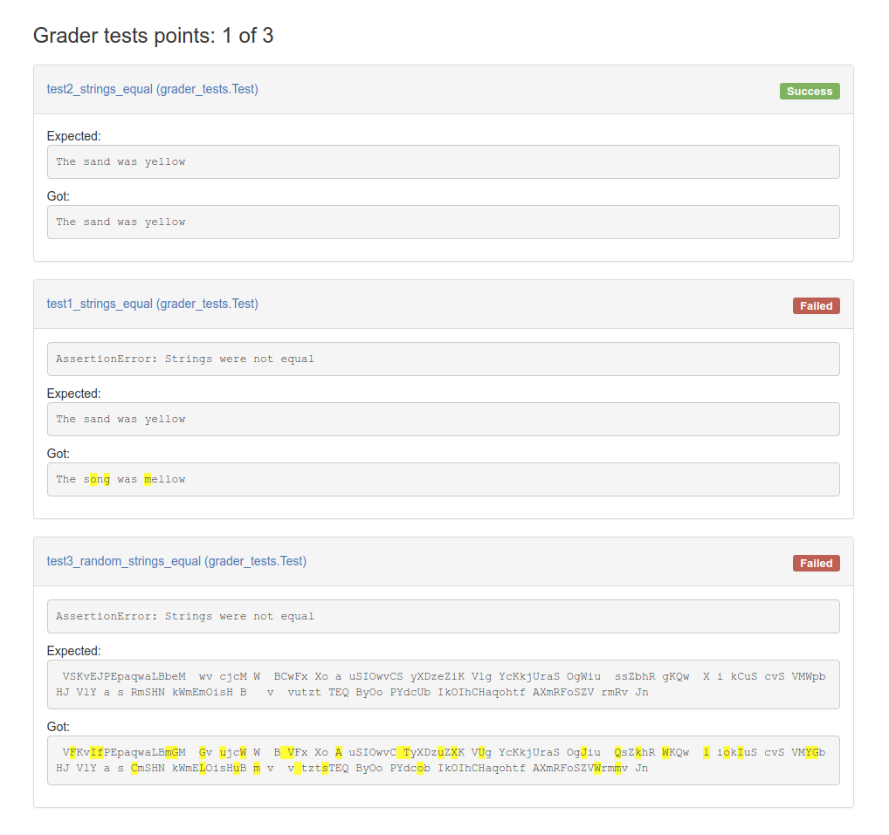

This example shows one solution how to compare two strings and highlight differing characters with CSS.



Run the tests as with previous examples:
```
python3 -m graderutils.main test_config.yaml --develop-mode | python3 -m feedbackformat.html --full-document > results.html
```
You can now view `results.html` in a browser.
